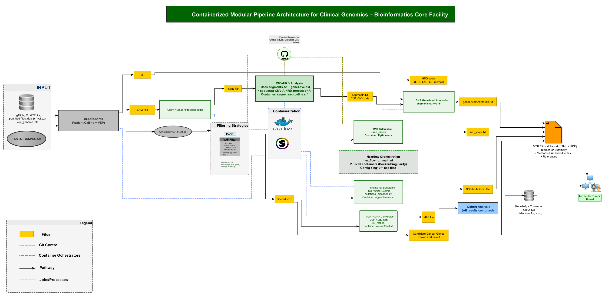

<h1 align="center">Hey There! 👋 I'm Chukwuma Winner Obiora</h1>

  
  

  <em>Clinical Genomics & Cancer Bioinformatics🎗️| Molecular Tumor Board Support</em> 
  <em>University of Augsburg  🇩🇪</em>

---

### 🧬 About Me

- 🔬 Bioinformatics Researcher specializing in **clinical genomics** and **cancer bioinformatics**
- 🏥 Developing automated pipelines for **molecular tumor board** presentations
- 📊 Working with WES, WGS, Panel Sequencing, and RNA-seq (bulk & single-cell)
###- 📝 Published in the **European Journal of Cancer**
##- 🌱 Currently exploring opportunities in Switzerland's biotech sector

---

### 🔬 Clinical Genomics Pipeline Architecture

  

---

### 🛠️ Tech Stack

  
  
  
  

  
  
  
  

  
  
  
  

---

### 🧪 Bioinformatics Tools

  
  
  
  
  
  
  
  
  
  
  
  
  
  
  
  
  
  
  
  
  
  
  
  
  
  
  
  
  
  

---
### 🚀 Featured Projects

  
  

  
  

---

### 📊 GitHub Stats

  
  

  

---

### 📫 Connect With Me

  
  
  

---

  <em>"Translating genomic data into clinical insights"</em> 🧬

